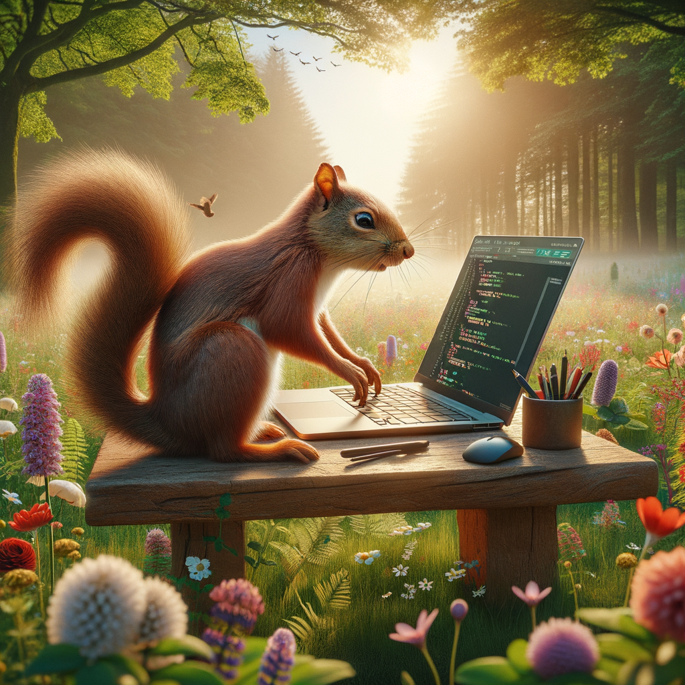

# image-generation

This CLI tool is a simple command-line interface for interacting with the OpenAI API. It was specifically created as a tool that GPTScript can leverage in order to provide the langauge with image generation capabilities.
It allows users to input a text prompt and get a response generated by OpenAI's GPT models.
Users can provide the API key directly as a command-line argument or set it through the credential tool.

## Features

- Accepts an OpenAI API key through the command line or environment variable.
- Accepts a text prompt for image generation and displays the resulting images.
- Supports image generation using a specified model, image size, quality, and the number of images to generate.

## Prerequisites

- Python 3.x
- OpenAI API key

## How to Build

This CLI tool does not require a build step, as it is a simple Python script. The only requirement is to install the necessary Python dependencies.

## Installation

1. Clone this repository or download the source code:

    ```bash
    git clone https://github.com/your-username/your-repo.git
    cd your-repo
    ```

2. Install the required Python packages:

    ```bash
    pip install -r requirements.txt
    ```

## Usage

You can run this CLI tool using the following command format:

```bash
python cli.py --api-key YOUR_API_KEY --prompt "Your text prompt here" --model MODEL_NAME --size IMAGE_SIZE --quality IMAGE_QUALITY --number NUMBER_OF_IMAGES
```

### CLI Arguments
| Argument | Short Command | Description | Example |
|----------|---------------|-------------|---------|
| API Key           | `-k` / `--api-key`   | Optional: Your OpenAI API key. Can also be set with OPENAI_API_KEY environment variable. Command-line option takes precedence.       | `--api-key YOUR_API_KEY`                  |
| Prompt            | `-p` / `--prompt`    | Required: The text prompt for image generation.                                                                                    | `--prompt "Your text prompt here"`        |
| Model             | `-m` / `--model`     | Optional: The model to use for image generation. Default is "dall-e-3".                                                            | `--model MODEL_NAME`                      |
| Size              | `-s` / `--size`      | Optional: The size of the image to generate, in the format WxH (e.g., 1024x1024). Default is 1024x1024.                           | `--size IMAGE_SIZE`                       |
| Quality           | `-q` / `--quality`   | Optional: The quality of the generated image. Allowed values are "standard" or "hd". Default is "standard".                        | `--quality IMAGE_QUALITY`                 |
| Number | `-n` / `--number`    | Optional: The number of images to generate. Default is 1.                                                                          | `--number NUMBER`               |

## Authentication

An OpenAI API key is needed in order to authenticate. When running the tool with GPTScript, the credential tool will
prompt you to provide a key if you have not done so already. When running the Python program directly, you can provide
it as a command-line argument or set it as an environment variable.

### Setting the API Key as an Environment Variable

On Unix-like systems, you can set the environment variable like this:

```bash
export OPENAI_API_KEY="your-api-key-here"
```

On Windows, you can set the environment variable like this:

```cmd
set OPENAI_API_KEY=your-api-key-here
```

After setting the environment variable, you only need to provide the prompt argument when running the tool:

```bash
python cli.py --prompt "Describe a futuristic city."
```

## Examples

### Tool Usage
This repository is made to integrate nicely with GPTScript. Accordingly, a [tool.gpt](./tool.gpt) file is provided that allows other GPTScripts to usage this tool.
The following is an example of how to use this tool in a GPTScript where it assumes that the tool is located in the parent directory of the GPTScript file:

```gpt
tools: ./tool.gpt

You are an expert in image generation. Please generate a cartoon lion standing proudly in the savannah.
```

You can find this specific example in the [examples](./examples/example.gpt) file.

### Images
#### Cartoon lion standing proudly in the savannah
```bash
python cli.py --prompt "Cartoon lion standing proudly in the savannah" --quality "standard"
```


#### A realistic photograph of a squirrel writing some code in a peaceful meadow
```bash
python cli.py --prompt "A realistic photograph of a squirrel writing some code in a peaceful meadow" --quality "hd"
```



#### The eiffel tower rendered photorealistically at night with a swirling sky as the background
```bash
python cli.py --prompt "The eiffel tower rendered photorealistically at night with a swirling sky as the background" --quality "hd"
```

